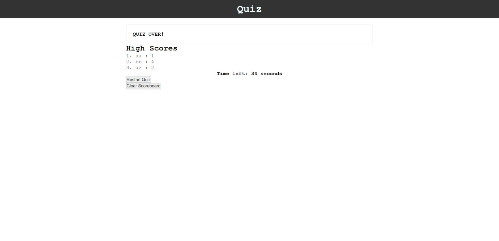
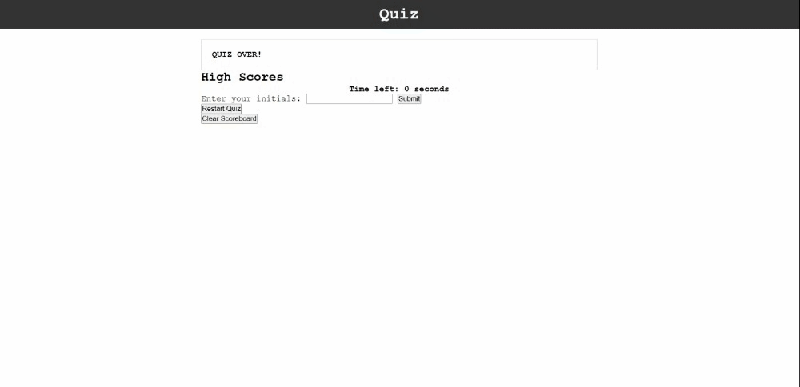

# Multiple Choice Quiz

## Description

Welcome to the Code Quiz! This web application is designed to test your knowledge of JavaScript fundamentals in a fun and interactive way. The quiz presents a series of multiple-choice questions, and you'll have to answer them before the timer runs out. Your score will be based on the number of correct answers and the time remaining. (For demonstration purposes.)

## Table of Contents

- [User Story](#user-story)
- [Acceptance Criteria](#acceptance-criteria)
- [Demo](#demo)
- [Deployed Application](#deployed-application)
- [Installation](#installation)
- [Usage](#usage)
- [Technologies Used](#technologies-used)
- [Features](#features)
- [Credits](#credits)
- [Contact](#contact)

## User Story

As a coding boot camp student, I want to take a timed quiz on JavaScript fundamentals that stores high scores, so that I can gauge my progress compared to my peers.

## Acceptance Criteria

The Code Quiz application should meet the following criteria:

1. When the user clicks the "Start" button, a timer starts, and the user is presented with the first question.
2. After answering a question, the user is presented with the next question until all questions are answered or the timer reaches 0.
3. If the user answers a question incorrectly, time is subtracted from the clock.
4. When the game is over, the user can save their initials and score.
5. The application should have a clean, polished, and responsive user interface.

## Demo

Here's a short demo showcasing the functionality of the Code Quiz:

## Deployed Application

You can access the deployed version of the Code Quiz at [URL](https://arsalanbardsiri.github.io/multiple-choice-quiz/).

## Installation

To run the Code Quiz locally, follow these steps:

1. Clone the repository: `git clone https://github.com/arsalanbardsiri/multiple-choice-quiz.git`
2. Navigate to the project directory: `cd multiple-choice-quiz`
3. Open the `index.html` file in your web browser.

## Usage

- Click the "Start" button to begin the quiz.
- Read each question carefully and select your answer by clicking on the provided choices.
- If you answer a question incorrectly, time will be deducted from the timer.
- The quiz ends when all questions are answered or the timer runs out.
- After completing the quiz, enter your initials to save your score on the leaderboard.

## Technologies Used

The Code Quiz application is built using the following technologies:

- HTML 
- CSS 
- JavaScript 

## Features

- Timed quiz with multiple-choice questions.
- Dynamic updating of questions and choices using JavaScript.
- High scores are saved in Local Storage for future reference.

## Credits

- [Arsalan Bardsiri](https://github.com/arsalanbardsiri) - Developer

## Contact

If you have any questions or feedback about the Code Quiz, feel free to reach out:

- Email: arsalanbardsiri@gmail.com
- GitHub: [github.com/arsalanbardsiri](https://github.com/arsalanbardsiri)

Thank you for playing the Code Quiz!
